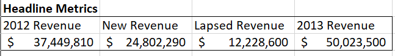
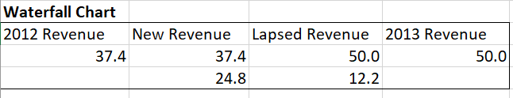
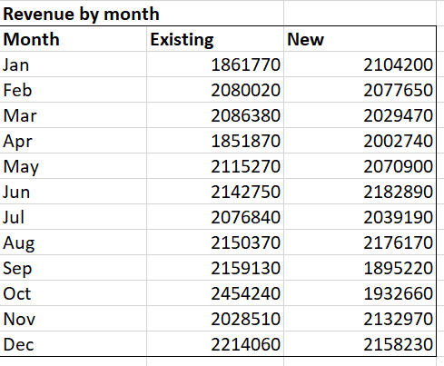
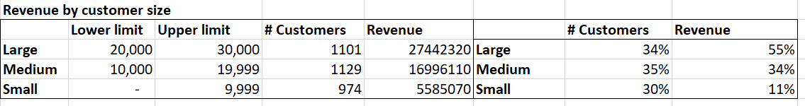
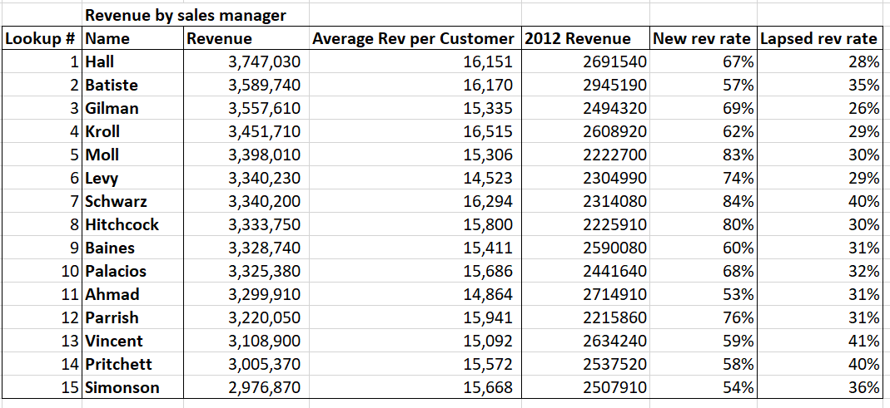
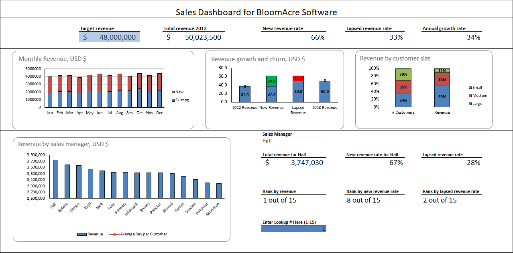

# Sales-Dashboard-Using-Excel

About Using Bloomacre Software sales data for the year to create an interactive dashboard that highlights each sales managers performance and provides insightful revenue statistics. The dashboard can be interacted with by entering a look up number from 1-15 assigned to each sales manager in cell K31.

Along with the dashboard the company want to implement their data in to an SQL database to allow for quick and easy data query's.

Skills Showcased:

-   Data Analysis
-   Microsoft Excel
-   SQL
-   Database Structures

[View more projects like this!](https://cian-murray-doyle.github.io/)

## Preparing the Data

Before the dashboard can be created we need to create some tables with the data we want to show. Firstly we will split the data into New and Lapsed revenue, then we can calculate this year and last years revenue. This gives an insight into the breakdown of the firms cashflow.



Now we can scale these values to be represented in millions to create an easily understood waterfall chart.



To gain more insight into the revenue of the company we will breakdown the split of new and existing revenue per month.



Having some understanding of the revenue type breakdown of the company we now want to look at the type of customer the company has. We will split the customers into small, medium, and large by the revenue they create. Then we will calculate the % of the customer base each category makes up as well as the % of revenue they create.



Finally, we want to gain some understanding of each managers performance. Calculating their total revenue, average revenue per customer and the % breakdown of their revenue type.



These tables contain all the insights we need to create an informative dashboard, next we simply choose the visualisation types and input the table information, to create an easily understood and interactive dashboard within Excel.



## Creating the Database

In order to move this data into an SQL database we first split it into three different files, transaction data, customer data, and the customer location data. These files will represent the three tables in our database.

```sql
CREATE TABLE customers(
company_name VARCHAR(36) PRIMARY KEY,);
```

As one company can have multiple locations we need to split this data into a seperate table, connected to the customer table through company_name.

```sql
CREATE TABLE customer_location(
company_name VARCHAR(36),
address VARCHAR(30),
city VARCHAR(16),
state_code VARCHAR(2),
zip_code INT,
FOREIGN KEY (company_name) REFERENCES customers(company_name));
```
The we create the transactions table connected to the customers table through company_name.

```sql
CREATE TABLE transactions(
transaction_id INT PRIMARY KEY,
salesperson VARCHAR(9),
transaction_date DATE,
payment_month VARCHAR(3),
status VARCHAR(8),
revenue NUMERIC(10,2),
company_name VARCHAR(36),
FOREIGN KEY(company_name) REFERENCES customers(company_name));
```

Now we can simply import the csv data into the tables.

```sql
COPY customers(company_name)
FROM 'C:\Users\Public\Public Doc4SQL\customers_name.csv'
DELIMITER ','
CSV HEADER;

COPY transactions(transaction_id, salesperson, transaction_date, payment_month,status,revenue,company_name)
FROM 'C:\Users\Public\Public Doc4SQL\transaction_data.csv'
DELIMITER ','
CSV HEADER;

COPY customer_location(company_name, address, city, state_code, zip_code)
FROM 'C:\Users\Public\Public Doc4SQL\customers_data.csv'
DELIMITER ','
CSV HEADER;
```

This allows us to carry out quick and easy query's on the data. For example we can rank the top 5 sales managers by total revenue.

```sql
SELECT salesperson, SUM(revenue)
FROM transactions
JOIN customers ON transactions.company_name = customers.company_name
GROUP BY salesperson
ORDER BY SUM DESC
LIMIT 5;
```

We can view the total amount of new revenue generated each month.

```sql
SELECT payment_month, SUM(revenue) as total_new_revenue
FROM transactions
WHERE status = 'New'
GROUP BY payment_month
ORDER BY total_new_revenue DESC;
```

We can display the average revenue by customer and the state they are in.

```sql
SELECT state_code, transactions.company_name, AVG(revenue)
FROM customers
JOIN transactions ON customers.company_name = transactions.company_name
JOIN customer_location ON customers.company_name = customer_location.company_name
GROUP BY state_code, transactions.company_name;
```

These database queries allow for the company to quickly access information without the need for updating the original dashboard.
